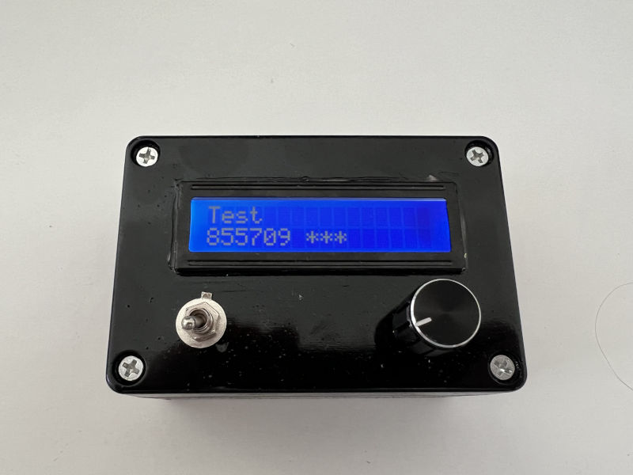
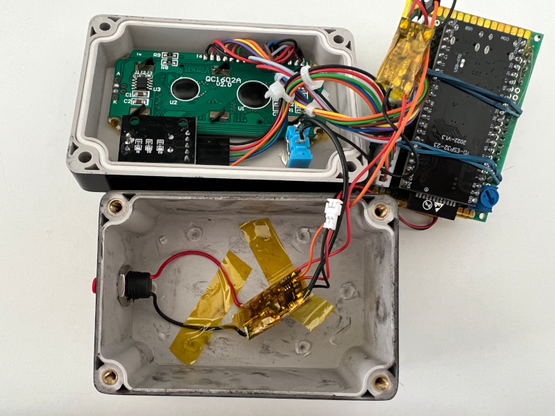
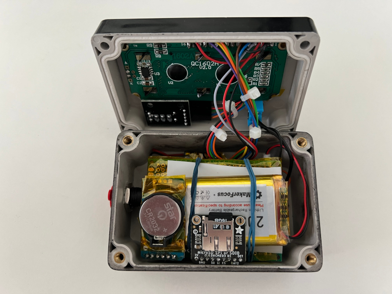
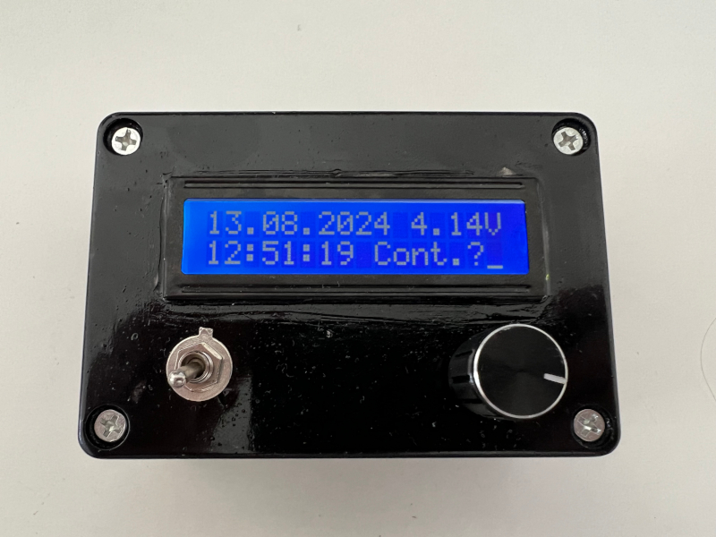
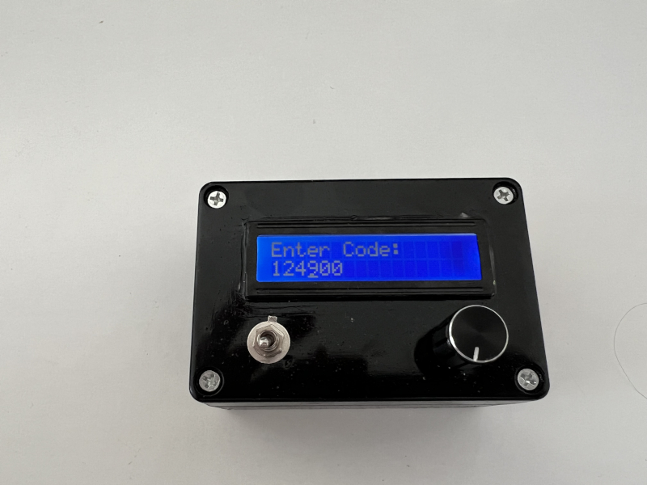

# ESP32 Hardware TOTP Gadget

A ESP32-S3 based hardware TOTP token generator. On a high level the devices uses a real time clock to store the current
time, even if switched off. When you power on the device you enter your 6 digit pin to decrypt the config. Then you can
scroll through your list of TOTP tokens.

## BOM

I build this mostly with stuff that I had lying around. I linked to the shops where I think I bought them, but you'll
find the parts elsewhere too.

* [ESP32-S3 WROOM-1-N16R8](https://www.amazon.de/dp/B0CP3ZF8V6)
* [RTC DS3231 I2C](https://www.az-delivery.de/en/products/ds3231-real-time-clock)
* [Micro SD SPI or SDIO Card Breakout Board](https://www.mouser.de/ProductDetail/Adafruit/4682?qs=hWgE7mdIu5TtvwzYJhYD8g%3D%3D)
* [Boost Step Up Converter 3.7V to 5V](https://www.amazon.de/dp/B0CW9P4CQP)
* [TP4056 BMS](https://www.az-delivery.de/en/products/az-delivery-laderegler-tp4056-micro-usb?_pos=3&_sid=6717c78a5&_ss=r)
* [HD44780 1602 LCD](https://www.az-delivery.de/en/products/16x2lcddisplay)
* [KY-040 Rotary Encoder](https://www.amazon.de/dp/B09726Y8RB)
* Switch
* 2x 10kOhm resistors
* 2000mAh LiPo Battery

I modified the LCD to also work with 3.3V (instead of 5V). In the retrospective this was not necessary, since the LDO on
the dev board expects 5V input. You should be able to also build the whole thing with 3.3V if you have a different dev
board. If followed this [article](https://www.smythe-consulting.com/2018/04/converting-5v-lcd-displays-to-3v.html) to
modify the board for 3.3V and used the following parts:

* [ICL7660](https://www.mouser.de/ProductDetail/Renesas-Intersil/ICL7660CBAZA-T?qs=9fLuogzTs8IgQwA5x5QxYQ%3D%3D&countryCode=DE&currencyCode=EUR)
* [10uF ceramic capacitors](https://www.mouser.de/ProductDetail/KYOCERA-AVX/1206ZG106ZAT2A?qs=%2Fgi80NE7irqA0d5QN2%252BtGg%3D%3D&countryCode=DE&currencyCode=EUR)

## Design / Software

The secret keys of the TOTP tokens are stored inside a JSON file on the SD card (named `CFG` without extension). The
secrets are encrypted using AES-128 in CTR mode. Since a 6 digit pin is quite weak, I did not use authenticated
encryption, hence you do not know if the pin is correct, the device is always generating a TOTP code, just not always
the correct one.

Flow:

1. After power on the device shows the current time and battery voltage
2. After you press the button of the rotary encoder you can enter your pin
3. Use the rotary to scroll through the digits and confirm each position by pressing the rotary button
4. After entering the pin (i.e. confirming the last digit) the devices enters the app mode, which displays the TOTP
   codes.
5. Use the rotary encoder to scroll back and forth through the list.

## Wiring

### RTC

| RTC | ESP32 |
|-----|-------|
| 32K | -     |
| SQW | -     |
| SCL | IO06  |
| SDA | IO04  |
| VCC | 3V3   |
| GND | GND   |

### SD Card

| SD-Card     | ESP32 |
|-------------|-------|
| 3V          | 3V3   |
| GND         | GND   |
| CLK         | IO18  |
| DAT0 / MISO | IO15  |
| CMD / MOSI  | IO17  |
| DAT3 / CS   | IO16  |
| DAT1        | -     |
| DAT2        | -     |
| DET         | -     |

### LCD

| LCD | ESP32                                       |
|-----|---------------------------------------------|
| VSS | 3V3                                         |
| VDD | GND                                         |
| V0  | `Connected to output of trim potentiometer` |
| RS  | IO46                                        |
| RW  | GND                                         |
| E   | IO13                                        |
| D0  | -                                           |
| D1  | -                                           |
| D2  | -                                           |
| D3  | -                                           |
| D4  | IO12                                        |
| D5  | IO11                                        |
| D6  | IO10                                        |
| D7  | IO09                                        |
| A   | 3V3                                         |
| K   | GND                                         |

### Rotary Encoder

| KY-040 | ESP32 |
|--------|-------|
| CLK    | IO42  |
| DT     | IO02  |
| SW     | IO01  |
| VCC    | 3V3   |
| GND    | GND   |

### ADC / Voltage Monitor

I used a simple voltage divider, build with two 10kOhm resistors. The output is connected to `IO14`.

## Schematic

TODO

## FAQ

### Why?

I was annoyed by the inability to export my TOTP secrets from Authy, so I wanted a more interoperable solution
for all the 2FA codes I collected over the years. Since I took a recent interest in Rust, I decided that this might be a
good learning project for more Rust. It's also kind of cool (lol).

### Is this secure?

**Probably not! Use a FIDO / U2F hardware authenticator instead!**

### Power supply circuit

I prototyped it on a breadboard, powered using 5V via USB. The board had only 3.3V output, so I modified the LCD
accordingly. I (wrongly) assumed that the LDO on the board would accept Inputs between 3.3V and 5V and just regulate
accordingly to 3.3V. But the AMS1117 on my board has a too high drop out voltage for this. At least I learned something
about LDOs!
I the used a boost step up converter, which I found on Amazon, to quickly finish the project. A future solution might be
to use another dev board with a different LDO.

## Images

